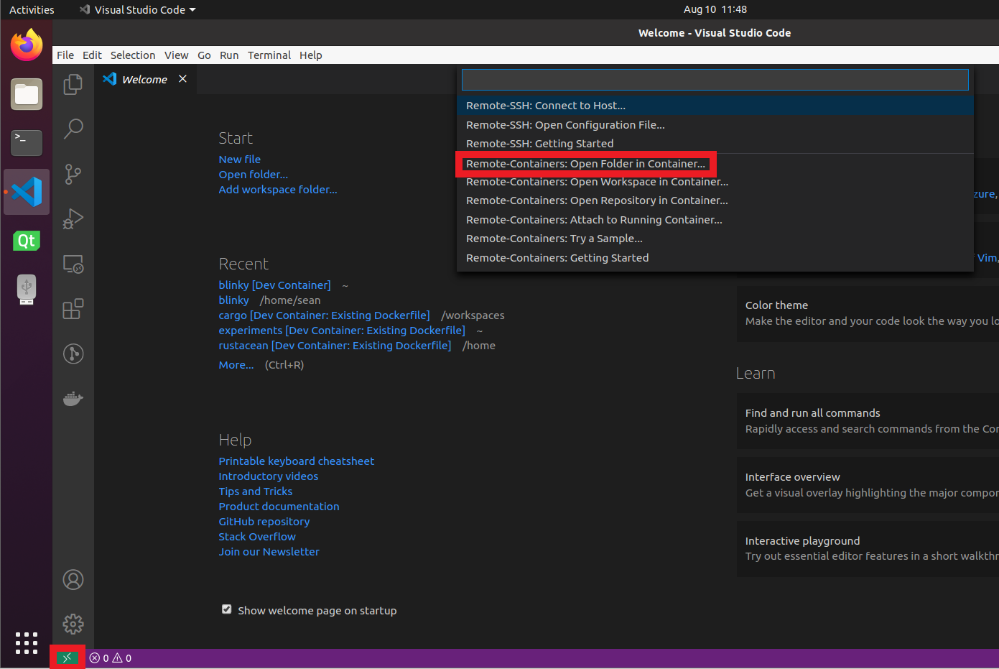

# Rust-Interoperability-Ceedling
An example of rust being called by the ceedling testing framework. At a high level, the rust code is simply acting as a library. There is a simple script that will recompile the rust library and produce the equivalent c headers whenever a ceedling build is invoked.

# Requirements to reproduce
- [Docker](https://docs.docker.com/engine/install/)
- [VSCode](https://code.visualstudio.com/)
- VSCode extension: [Remote - Containers](https://marketplace.visualstudio.com/items?itemName=ms-vscode-remote.remote-containers)

The remaining instructions will assume you have these requirements correctly installed.

# Setup

1. Open VSCode.

2. Open the repository within a remote container by selecting the green `><` icon in the bottom left corner and select `Remote-Containers: Reopen in Container`. 

3. Select the directory containing the `Dockerfile` of this repository. VSCode should reopen and begin building the docker image for the environment. This can take up to 5 minutes the first time.

Congratulations. You should now have a fully functional environment.

# Running ceedling unit tests
Simply navigate to the `c` directory and type

```bash
ceedling test:all
```

you should see 

```
-----------
TEST OUTPUT
-----------
[test_rust-generated.c]
  - "2 + 2 = 4"
  - "Hello from Rust! :)"

--------------------
OVERALL TEST SUMMARY
--------------------
TESTED:  2
PASSED:  2
FAILED:  0
IGNORED: 0
```
in the output.

You can see that the source code that generated the "2 + 2 = 4" and "Hello from Rust! :)" in `rust/src/lib.rs` and `rust/src/math.rs`.

The functions were invoked from `c/test/test_rust-generated.c`

# Notable Configuration files
- `project.yml` - used to extend the functionality of ceedling.

    modified fields:
    ```yml
    :paths:
        :libraries: "<rust library path>
    ```
    ```yml
    :tools:
        :pre_build:
            :executable: scripts/pre_build.py
    ```
    ```yml
    # Not sure why but the "." must exist in this line.
    # Otherwise a linking error will occur when a new unit test is written.
    # See also...
    # https://www.greyblake.com/blog/2017-08-10-exposing-rust-library-to-c/
    :libraries:
        :path_flag: "-L. ${1}"
    ```
    ```yml
    # Allows the pre_build hook to run
    :plugins:
        :enabled:
            - command_hooks
    ```

- `c/scripts/pre_build.py` -  A script that compiles the rust libraries and produces the corresponding c headers in the `c/src/` directory.

- `rust/cbingen.toml` - specifies how c headers should be generated. See https://github.com/eqrion/cbindgen/blob/master/docs.md for documentation.

- `rust/Cargo.toml` - Manifest used by the cargo build system.
    modified fields: 
    ```toml
    [lib]
    name="rust_code_callable_from_c"
    crate-type = ["cdylib"]
    ```
    Tells rust to create the library as a c dynamic library. See https://rust-embedded.github.io/book/interoperability/rust-with-c.html for further documentation.

